# LobsterAI 定时任务系统设计文档

## 总述

LobsterAI 的定时任务系统是一套横跨 **Renderer(UI) -> Main Process(IPC/业务逻辑) -> OpenClaw Gateway(调度引擎)** 三层的端到端自动化执行框架。它允许用户通过 UI 界面、IM 聊天或 Cowork 会话创建定时任务，由 OpenClaw 的 Cron 引擎进行调度触发，并将执行结果通过 IM 通道或 Webhook 投递给用户。

**核心设计理念**：

1. **OpenClaw 驱动** -- 所有定时任务的调度、执行、投递均由 OpenClaw Gateway 原生完成，LobsterAI 作为上层应用只负责任务的 CRUD 和 UI 展示，不接管消息投递逻辑
2. **策略模式(Policy Pattern)** -- 不同来源的任务(UI/IM/Cowork/Legacy)各自拥有独立的策略类，控制默认参数、绑定关系、只读字段等行为
3. **来源推断(Origin Inference)** -- 通过 `sessionKey` 的格式反向推断任务来源和执行绑定，实现与旧数据的无缝兼容
4. **流式轮询** -- 通过 15 秒间隔的轮询机制将 OpenClaw 的任务状态变化实时推送到 UI

### 系统总体架构

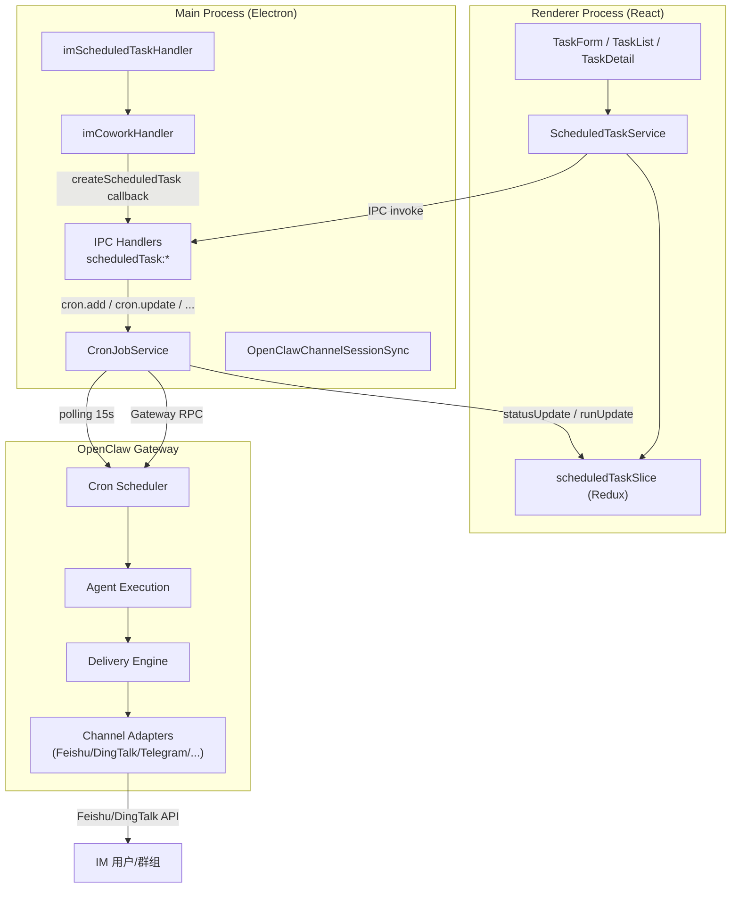

---

## 分述：各模块详解

---

### 1. 类型系统 (`src/renderer/types/scheduledTask.ts`)

定义了定时任务的全部前端类型，是 Renderer 与 Main Process 之间 IPC 通信的数据契约。

#### 1.1 Schedule -- 调度时间

```typescript
type Schedule =
  | { kind: 'at'; at: string }              // 一次性：ISO 8601 时间戳
  | { kind: 'every'; everyMs: number; anchorMs?: number }  // 固定间隔（毫秒）
  | { kind: 'cron'; expr: string; tz?: string; staggerMs?: number }  // Cron 表达式
```

#### 1.2 Payload -- 执行内容

```typescript
type ScheduledTaskPayload =
  | { kind: 'agentTurn'; message: string; timeoutSeconds?: number }   // Agent 对话轮次
  | { kind: 'systemEvent'; text: string }                              // 系统事件注入
```

- `agentTurn`：在隔离会话中执行完整的 Agent 对话轮次，支持超时控制
- `systemEvent`：向主会话注入一条系统事件消息

#### 1.3 Delivery -- 投递配置

```typescript
interface ScheduledTaskDelivery {
  mode: 'none' | 'announce' | 'webhook';
  channel?: string;      // IM 通道名：'feishu', 'dingtalk-connector', 'telegram' 等
  to?: string;           // 目标标识：会话 ID 或 Webhook URL
  accountId?: string;    // 多账号场景下的账号标识
  bestEffort?: boolean;  // 投递失败是否影响任务状态
}
```

#### 1.4 TaskState -- 运行状态

```typescript
interface TaskState {
  nextRunAtMs: number | null;
  lastRunAtMs: number | null;
  lastStatus: 'success' | 'error' | 'skipped' | 'running' | null;
  lastError: string | null;
  lastDurationMs: number | null;
  runningAtMs: number | null;
  consecutiveErrors: number;
}
```

#### 1.5 核心类型关系

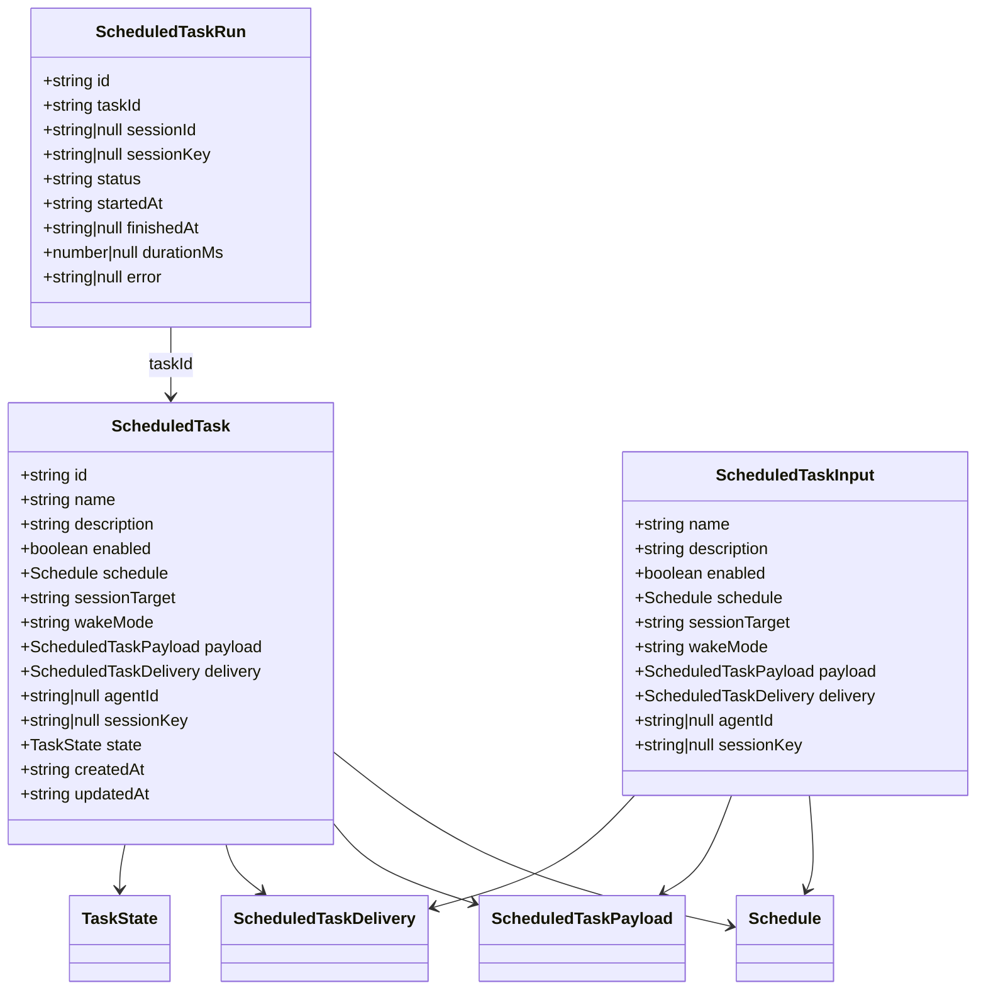

---

### 2. 策略模式 (`src/common/scheduledTaskPolicies/`)

策略模式是定时任务系统的核心设计抽象，用于处理不同来源任务的差异化行为。

#### 2.1 TaskPolicy 接口

```typescript
interface TaskPolicy {
  readonly kind: TaskOriginKind;
  getCreateDefaults(origin: TaskOrigin): Partial<PolicyTaskInput>;
  normalizeDraft(draft: PolicyTaskModel): PolicyTaskModel;
  onDeliveryChanged(draft: PolicyTaskModel, newDelivery: PolicyDelivery): PolicyTaskModel;
  toWireBinding(binding: ExecutionBinding): WireBinding;
  describeRunBehavior(task: PolicyTaskModel): string;
  getReadonlyFields(): string[];
}
```

每个方法的职责：

| 方法 | 职责 |
|------|------|
| `getCreateDefaults` | 返回该来源任务的默认参数 |
| `normalizeDraft` | 保存前的归一化校验（自动填充、绑定一致性） |
| `onDeliveryChanged` | 用户修改投递配置时联动更新绑定关系 |
| `toWireBinding` | 将领域模型的 `ExecutionBinding` 映射为 OpenClaw 的 `sessionTarget`/`sessionKey` |
| `describeRunBehavior` | 生成人类可读的运行行为描述 |
| `getReadonlyFields` | 返回 UI 中不可编辑的字段列表 |

#### 2.2 四种策略实现

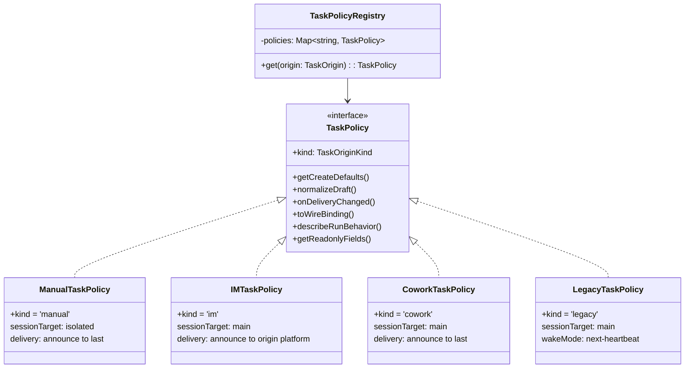

**各策略默认参数对比：**

| 策略 | sessionTarget | wakeMode | delivery.mode | delivery.channel | 只读字段 |
|------|--------------|----------|---------------|-----------------|---------|
| ManualTaskPolicy | `isolated` | `now` | `announce` | `last` | 无 |
| IMTaskPolicy | `main` | `now` | `announce` | 来源平台 | `origin` |
| CoworkTaskPolicy | `main` | `now` | `announce` | `last` | `origin` |
| LegacyTaskPolicy | `main` | `next-heartbeat` | -- | -- | `origin` |

**策略切换 delivery 时的绑定联动：**

- **ManualTaskPolicy**：当用户选择 IM 通道投递时，自动将 binding 切换为 `im_session`；取消 IM 投递时，重置为 `new_session`
- **IMTaskPolicy**：投递通道始终锁定在来源 IM 平台；切换为 `none`/`webhook` 时重置为 `new_session`
- **CoworkTaskPolicy**：投递变更不影响绑定（始终绑定原始会话）
- **LegacyTaskPolicy**：兼容旧任务，投递为 IM 时自动创建 `im_session` 绑定

#### 2.3 TaskPolicyRegistry

```typescript
const taskPolicyRegistry = new TaskPolicyRegistry([
  new LegacyTaskPolicy(),
  new IMTaskPolicy(),
  new CoworkTaskPolicy(),
  new ManualTaskPolicy(),
]);
```

通过 `registry.get(origin)` 获取对应策略；如果 origin 不匹配，fallback 到 `ManualTaskPolicy`。

---

### 3. 来源与绑定推断 (`src/common/scheduledTaskOrigin.ts`)

定义了任务的**来源(Origin)**和**执行绑定(Binding)**两个核心概念。

#### 3.1 TaskOrigin -- 任务从哪里来

```typescript
type TaskOrigin =
  | { kind: 'legacy' }                                         // 旧版任务
  | { kind: 'im'; platform: string; conversationId: string }   // IM 创建
  | { kind: 'cowork'; sessionId: string }                      // Cowork 会话创建
  | { kind: 'manual' }                                         // UI 手动创建
```

#### 3.2 ExecutionBinding -- 任务如何执行

```typescript
type ExecutionBinding =
  | { kind: 'new_session' }                                      // 每次触发创建新会话
  | { kind: 'ui_session'; sessionId: string }                    // 在指定 UI 会话中执行
  | { kind: 'im_session'; platform: string; conversationId: string; sessionId?: string }  // IM 会话绑定
  | { kind: 'session_key'; sessionKey: string }                  // 使用显式 sessionKey
```

#### 3.3 inferOriginAndBinding -- 反向推断

`inferOriginAndBinding()` 函数通过解析 `sessionKey` 的格式来反向推断任务的来源和绑定，用于兼容没有存储元数据的旧任务：

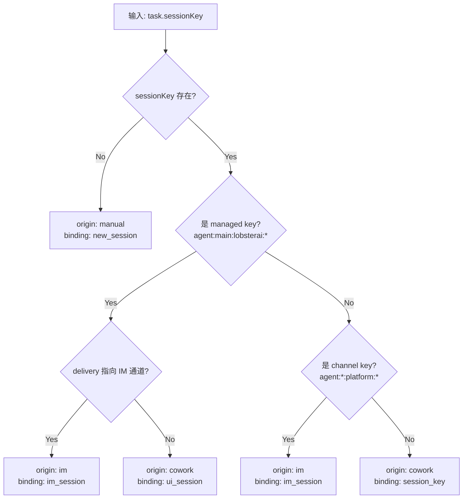

**SessionKey 格式说明：**

| 格式 | 示例 | 含义 |
|------|------|------|
| `agent:main:lobsterai:{sessionId}` | `agent:main:lobsterai:abc123` | 托管会话（UI/Cowork 创建） |
| `agent:{agentId}:{platform}:{subtype}:{conversationId}` | `agent:main:feishu:direct:ou_xxx` | IM 通道会话 |
| `cron:{jobId}` | `cron:job-456` | 隔离的 Cron 会话 |

---

### 4. TaskModelMapper (`src/common/taskModelMapper.ts`)

负责**线格式(Wire Format)**与**领域模型(Domain Model)**之间的双向转换。

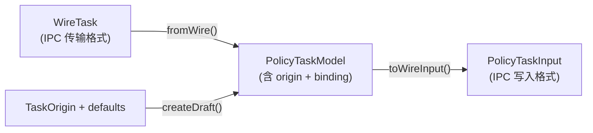

三个核心方法：

| 方法 | 输入 | 输出 | 用途 |
|------|------|------|------|
| `fromWire()` | `WireTask` + 可选 `meta` | `PolicyTaskModel` | 从 IPC 数据还原领域模型 |
| `toWireInput()` | `PolicyTaskModel` + `TaskPolicy` | `PolicyTaskInput` | 保存时转为 IPC 格式 |
| `createDraft()` | `TaskOrigin` + `defaults` | `PolicyTaskModel` | 创建空白草稿 |

---

### 5. 提醒文本解析 (`src/common/scheduledReminderText.ts`)

处理三种不同格式的定时提醒文本，提供统一的解析接口。

**支持的格式：**

| 格式 | 示例 | 解析函数 |
|------|------|---------|
| 结构化提示 | `A scheduled reminder has been triggered. The reminder content is: ...` | `parseScheduledReminderPrompt()` |
| Legacy 系统消息 | `System: [2026-03-21 09:00] ⏰ 查看邮箱` | `parseLegacyScheduledReminderSystemMessage()` |
| 简单 emoji 格式 | `⏰ 提醒：查看邮箱` | `parseSimpleScheduledReminderText()` |

统一入口 `getScheduledReminderDisplayText()` 按优先级依次尝试三种解析器，返回纯文本提醒内容。

---

### 6. Renderer 层 -- UI 与状态管理

#### 6.1 组件结构

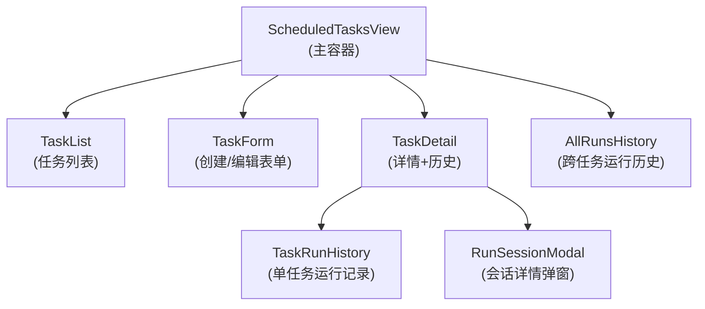

#### 6.2 ScheduledTaskService (`src/renderer/services/scheduledTask.ts`)

封装所有 IPC 调用并桥接 Redux dispatch：

```typescript
class ScheduledTaskService {
  // CRUD 操作
  async loadTasks()                          // IPC: scheduledTask:list
  async createTask(input)                    // IPC: scheduledTask:create
  async updateTaskById(id, partial)          // IPC: scheduledTask:update
  async deleteTask(id)                       // IPC: scheduledTask:delete
  async toggleTask(id, enabled)              // IPC: scheduledTask:toggle

  // 执行操作
  async runManually(id)                      // IPC: scheduledTask:runManually
  async stopTask(id)                         // IPC: scheduledTask:stop

  // 查询操作
  async loadRuns(taskId, limit?, offset?)    // IPC: scheduledTask:listRuns
  async loadAllRuns(limit?, offset?)         // IPC: scheduledTask:listAllRuns
  async listChannels()                       // IPC: scheduledTask:listChannels
  async listChannelConversations(channel)    // IPC: scheduledTask:listChannelConversations
}
```

#### 6.3 Redux Slice (`scheduledTaskSlice.ts`)

```typescript
interface ScheduledTaskState {
  tasks: ScheduledTask[];
  selectedTaskId: string | null;
  viewMode: 'list' | 'create' | 'edit' | 'detail';
  runs: Record<string, ScheduledTaskRun[]>;
  allRuns: ScheduledTaskRunWithName[];
  loading: boolean;
  error: string | null;
}
```

状态更新来源：
- **用户操作** -> Service 调用 -> IPC 返回 -> dispatch action
- **轮询推送** -> IPC 事件监听 -> dispatch action（`updateTaskState`, `addOrUpdateRun`）

---

### 7. Main Process -- IPC 处理与业务逻辑

#### 7.1 IPC 通道总览

共 14 个 `scheduledTask:*` invoke 通道 + 3 个广播事件：

| 通道 | 方向 | 功能 |
|------|------|------|
| `scheduledTask:list` | Request-Reply | 获取全部任务 |
| `scheduledTask:get` | Request-Reply | 获取单个任务 |
| `scheduledTask:create` | Request-Reply | 创建任务（含 IM delivery 归一化） |
| `scheduledTask:update` | Request-Reply | 更新任务（含 IM delivery 归一化） |
| `scheduledTask:delete` | Request-Reply | 删除任务 |
| `scheduledTask:toggle` | Request-Reply | 启用/禁用任务 |
| `scheduledTask:runManually` | Request-Reply | 手动触发执行 |
| `scheduledTask:stop` | Request-Reply | 停止执行（No-op） |
| `scheduledTask:listRuns` | Request-Reply | 获取任务运行历史 |
| `scheduledTask:countRuns` | Request-Reply | 获取运行次数 |
| `scheduledTask:listAllRuns` | Request-Reply | 获取全局运行历史 |
| `scheduledTask:resolveSession` | Request-Reply | 获取瞬态会话内容 |
| `scheduledTask:listChannels` | Request-Reply | 列出可用 IM 通道 |
| `scheduledTask:listChannelConversations` | Request-Reply | 列出通道下的会话 |
| `scheduledTask:statusUpdate` | Broadcast | 任务状态变更推送 |
| `scheduledTask:runUpdate` | Broadcast | 运行记录更新推送 |
| `scheduledTask:refresh` | Broadcast | 全量刷新信号 |

#### 7.2 Create/Update 的 IM Delivery 归一化

当 `delivery.mode === 'announce'` 且指定了 IM 通道时，IPC handler 执行以下归一化：

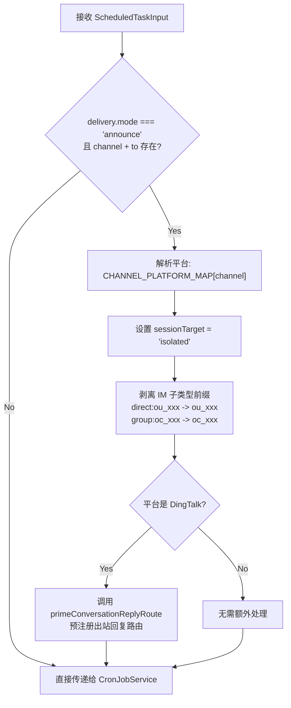

**为什么要剥离前缀？**

LobsterAI 的 `imStore` 中存储的 `conversationId` 带有 IM 子类型前缀（如 `direct:ou_xxx` 表示飞书私聊，`group:oc_xxx` 表示飞书群聊）。但 OpenClaw 的飞书插件中 `normalizeFeishuTarget()` 不识别 `direct:` 前缀，会将 `direct:ou_xxx` 原样传递给飞书 API，导致 400 错误。因此在传递给 OpenClaw 之前需要剥离此前缀。

---

### 8. CronJobService (`src/main/libs/cronJobService.ts`)

#### 8.1 职责

`CronJobService` 是 LobsterAI 与 OpenClaw Gateway 之间的 **适配器层**，封装了所有 Cron RPC 调用。

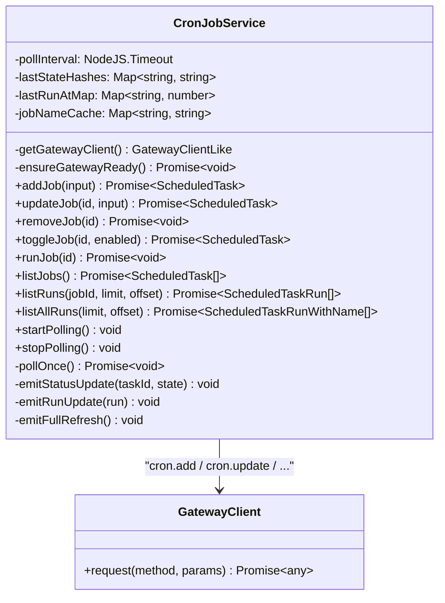

#### 8.2 Gateway RPC 方法映射

| CronJobService 方法 | Gateway RPC | 说明 |
|---------------------|------------|------|
| `addJob()` | `cron.add` | 创建 Cron Job |
| `updateJob()` | `cron.update` | 更新 Cron Job（patch 模式） |
| `removeJob()` | `cron.remove` | 删除 Cron Job |
| `toggleJob()` | `cron.update` | 更新 enabled 字段 |
| `runJob()` | `cron.run` | 立即触发执行 |
| `listJobs()` | `cron.list` | 列出所有 Job（含 disabled） |
| `listRuns()` | `cron.runs` | 查询 Job 的运行历史 |
| `listAllRuns()` | `cron.runs` | 查询全局运行历史 |

#### 8.3 轮询机制

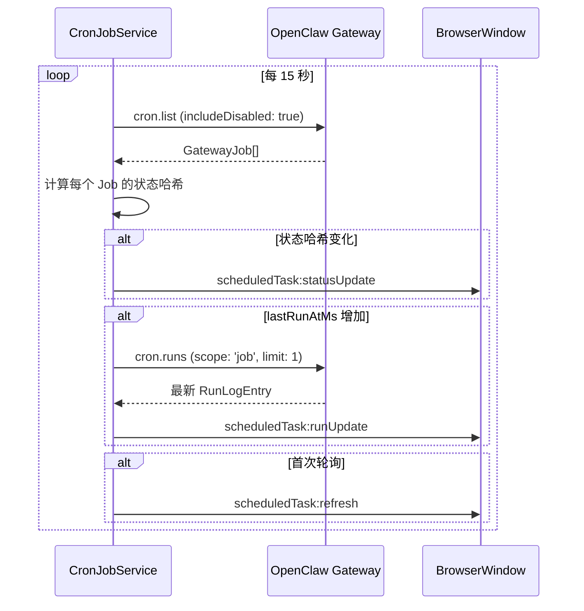

#### 8.4 类型映射

CronJobService 在 LobsterAI 前端类型和 OpenClaw Gateway 类型之间进行双向转换：

| 前端类型 | Gateway 类型 | 转换函数 |
|---------|-------------|---------|
| `Schedule` | `GatewaySchedule` | `mapGatewaySchedule()` / `toGatewaySchedule()` |
| `ScheduledTaskPayload` | `GatewayPayload` | `toGatewayPayload()` |
| `ScheduledTaskDelivery` | `GatewayDelivery` | `toGatewayDelivery()` |
| `TaskState` | `GatewayJobState` | `mapGatewayTaskState()` |
| `ScheduledTask` | `GatewayJob` | `mapGatewayJob()` |

---

### 9. IM 定时任务检测 (`src/main/im/imScheduledTaskHandler.ts`)

#### 9.1 检测流程

当用户通过 IM 发送消息时，系统会自动检测是否包含定时提醒请求：

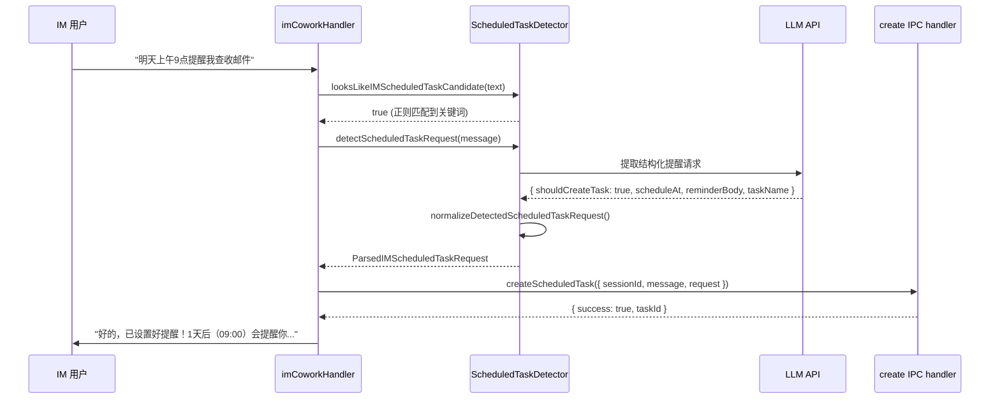

#### 9.2 检测管道

1. **正则预过滤** (`looksLikeIMScheduledTaskCandidate`)：检查消息是否包含时间相关关键词（`提醒`, `定时`, `闹钟`, `remind`, `schedule`, `tomorrow` 等）
2. **LLM 结构化提取**：调用 LLM 将自然语言解析为 `{ shouldCreateTask, scheduleAt, reminderBody, taskName }`
3. **归一化** (`normalizeDetectedScheduledTaskRequest`)：验证时间有效性、生成任务名称、格式化确认文本

#### 9.3 IM 创建的消息序列

直接检测到定时提醒请求后，`imCoworkHandler` 会记录以下消息序列到 Cowork 会话中：

```
[USER]       "明天上午9点提醒我查收邮件"
[TOOL_USE]   { toolName: "cron", action: "add", job: { name, schedule, payload } }
[TOOL_RESULT] { id, name, agentId, sessionKey, payloadText, scheduleAt }
[ASSISTANT]  "好的，已设置好提醒！1天后（09:00）会提醒你..."
```

---

### 10. 会话键管理 (`src/main/libs/openclawChannelSessionSync.ts`)

#### 10.1 SessionKey 格式

OpenClaw 使用 `sessionKey` 来标识和管理会话。LobsterAI 定义了三种格式：

| 类型 | 格式 | 示例 | 用途 |
|------|------|------|------|
| 托管会话 | `agent:{agentId}:lobsterai:{sessionId}` | `agent:main:lobsterai:abc123` | UI/Cowork 创建的会话 |
| 通道会话 | `agent:{agentId}:{platform}:{subtype}:{conversationId}` | `agent:main:feishu:direct:ou_xxx` | IM 平台的会话 |
| Cron 会话 | `cron:{jobId}` | `cron:job-456` | 隔离 Cron 任务的独立会话 |

#### 10.2 平台映射

```typescript
const CHANNEL_PLATFORM_MAP: Record<string, IMPlatform> = {
  'dingtalk-connector': 'dingtalk',
  'feishu': 'feishu',
  'telegram': 'telegram',
  'discord': 'discord',
  'netease-im': 'netease-im',
  'netease-bee': 'netease-bee',
};

const PLATFORM_TO_CHANNEL_MAP: Record<IMPlatform, string> = {
  'dingtalk': 'dingtalk-connector',
  'feishu': 'feishu',
  'telegram': 'telegram',
  'discord': 'discord',
  'netease-im': 'netease-im',
  'netease-bee': 'netease-bee',
};
```

#### 10.3 delivery.to 格式转换链

```mermaid
flowchart LR
    A["imStore 存储<br/>direct:ou_xxx"] -->|"UI TaskForm 选择"| B["ScheduledTaskInput<br/>delivery.to = direct:ou_xxx"]
    B -->|"IPC handler 剥离前缀"| C["CronJobService<br/>delivery.to = ou_xxx"]
    C -->|"Gateway RPC"| D["OpenClaw CronJob<br/>delivery.to = ou_xxx"]
    D -->|"触发时 announce"| E["Feishu Plugin<br/>normalizeFeishuTarget(ou_xxx)"]
    E -->|"Feishu API"| F["receive_id = ou_xxx<br/>receive_id_type = open_id"]
```

---

### 11. OpenClaw Cron 调度引擎

OpenClaw Gateway 内置 Cron 调度引擎，负责定时任务的存储、调度触发、会话创建、Agent 执行和结果投递。

#### 11.1 Cron Job 数据模型

```typescript
interface CronJob {
  id: string;
  name: string;
  description?: string;
  enabled: boolean;
  schedule: CronSchedule;           // at | every | cron
  sessionTarget: 'main' | 'isolated';
  wakeMode: 'now' | 'next-heartbeat';
  payload: CronPayload;            // systemEvent | agentTurn
  delivery?: CronDelivery;         // announce | webhook | none
  failureAlert?: CronFailureAlert;
  agentId?: string | null;
  sessionKey?: string | null;
  deleteAfterRun?: boolean;        // 一次性任务自动删除
  state: CronJobState;
  createdAtMs: number;
  updatedAtMs: number;
}
```

#### 11.2 两条执行路径

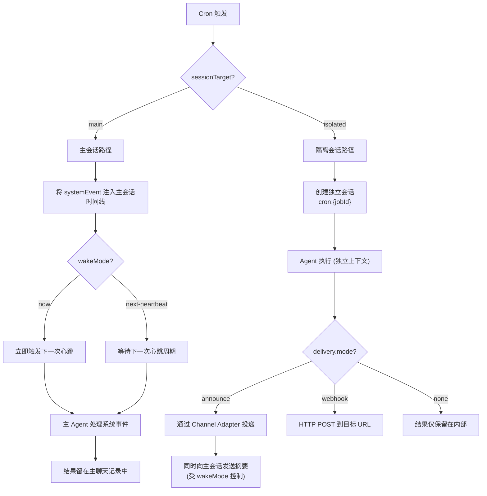

#### 11.3 Announce 投递详解

当隔离任务完成且 `delivery.mode = 'announce'` 时：

1. **Channel 路由**：根据 `delivery.channel` 选择对应的 Channel Adapter（Feishu、DingTalk、Telegram 等）
2. **目标解析**：`delivery.to` 指定具体的接收者（用户 ID、群组 ID、Webhook URL 等）
3. **消息分块**：长消息自动分块，适配各 IM 平台的消息长度限制
4. **去重**：如果隔离会话运行期间已经向同一目标发送过消息，跳过投递避免重复
5. **心跳过滤**：纯心跳响应（`HEARTBEAT_OK`）不投递
6. **主会话摘要**：向主会话发送简要摘要，时机由 `wakeMode` 控制

#### 11.4 重试与错误处理

**瞬态错误（自动重试）：**
- 速率限制 (429)
- 网络错误 (timeout, ECONNRESET)
- 服务器错误 (5xx)

**永久错误（立即禁用）：**
- 认证失败（API Key 无效）
- 配置/验证错误

**重试策略：**

| 任务类型 | 重试次数 | 退避策略 | 失败后行为 |
|---------|---------|---------|-----------|
| 一次性 (`at`) | 最多 3 次 | 30s -> 1m -> 5m | 禁用或删除 |
| 循环 (`cron`/`every`) | 不限次 | 30s -> 1m -> 5m -> 15m -> 60m | 保持启用，退避延长 |

#### 11.5 存储与清理

| 存储项 | 路径 | 清理策略 |
|-------|------|---------|
| Job 定义 | `~/.openclaw/cron/jobs.json` | 手动删除 |
| 运行历史 | `~/.openclaw/cron/runs/{jobId}.jsonl` | `runLog.maxBytes` (2MB) + `runLog.keepLines` (2000) |
| 隔离会话 | OpenClaw sessions | `sessionRetention` (默认 24h) |

---

## 完整生命周期：端到端流程

### 场景一：UI 创建 + 飞书投递

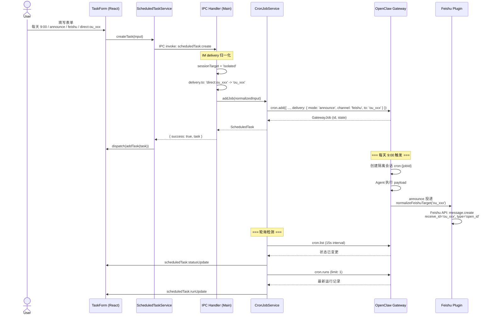

### 场景二：飞书消息创建定时提醒

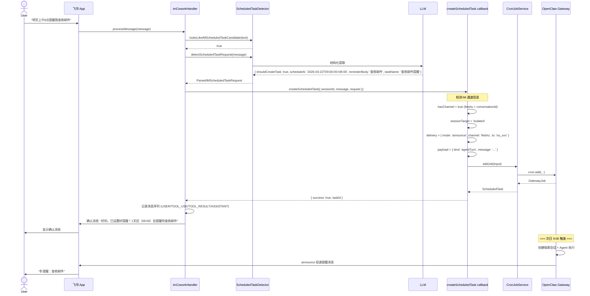

---

## 总结

LobsterAI 的定时任务系统通过三层架构实现了完整的自动化执行能力：

1. **前端层（Renderer）**：提供直观的 UI 界面用于任务的 CRUD 管理，通过 Redux + 轮询实现实时状态更新
2. **业务层（Main Process）**：通过 IPC handler + CronJobService 封装业务逻辑，负责 IM delivery 的归一化处理和类型映射
3. **引擎层（OpenClaw Gateway）**：承担所有调度、执行、投递的核心工作，确保 LobsterAI 不需要自行实现消息投递逻辑

**关键设计决策：**

| 决策 | 理由 |
|------|------|
| 策略模式区分任务来源 | 不同来源的默认参数、绑定关系、只读字段各不相同，策略模式避免了大量 if-else |
| 来源推断而非存储 | 通过 sessionKey 格式反推来源，无需修改 OpenClaw 的数据模型即可兼容旧数据 |
| 前缀剥离而非修改 OpenClaw | LobsterAI 的 `imStore` 需要带前缀的 ID 做内部路由，但 OpenClaw 的 Feishu 插件不识别该前缀，因此在传递给 OpenClaw 前剥离 |
| 15 秒轮询而非 WebSocket | OpenClaw Gateway 不暴露实时事件流，轮询是最简单可靠的状态同步方式 |
| `isolated` + `announce` 作为 IM 投递标准模式 | 隔离会话避免污染主聊天记录，announce 模式让 OpenClaw 原生处理消息投递，保持 OpenClaw 驱动的设计理念 |
